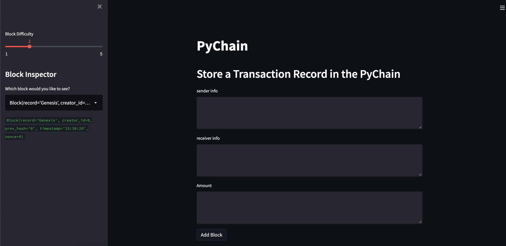
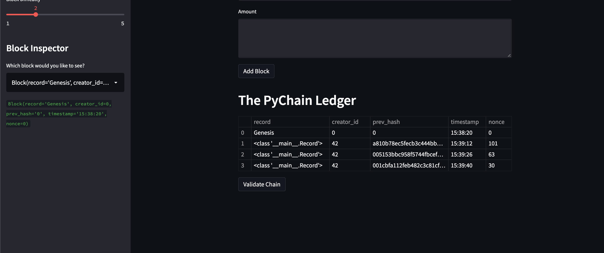

# Blockchain-homework

This is a demonstractional program written in python and run in streamlit, where a user can create mock hashed-block transactions and validate them in a mock blockchain environment. 

A streamlit interface has been created with the following:

- an input for the sender's information
- an input for receiver's information
- the amount to send
- a button to store above information in a block and add to chain
- a dataframe of the ledger
- a button to validate the chain

